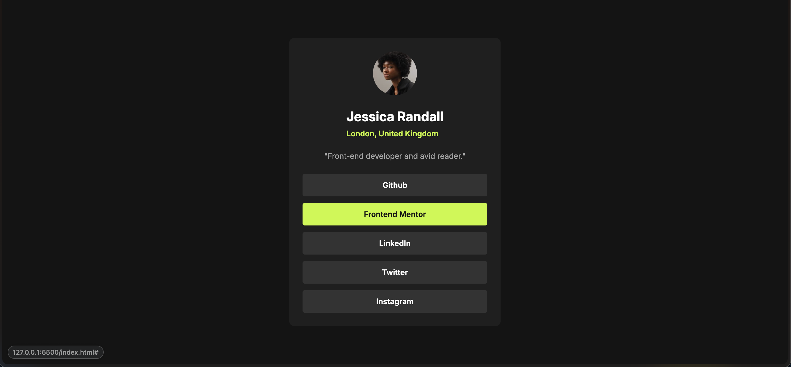

# Frontend Mentor - Social links profile solution

This is a solution to the [Social links profile challenge on Frontend Mentor](https://www.frontendmentor.io/challenges/social-links-profile-UG32l9m6dQ). Frontend Mentor challenges help you improve your coding skills by building realistic projects. 

## Table of contents

- [Overview](#overview)
  - [The challenge](#the-challenge)
  - [Screenshot](#screenshot)
  - [Links](#links)
- [My process](#my-process)
  - [Built with](#built-with)
  - [What I learned](#what-i-learned)
- [Author](#author)

## Overview
This challenge is to create a card component with profile picture and links to different profiles.

### The challenge

Users should be able to:

- See hover and focus states for all interactive elements on the page

### Screenshot

### Links

- Solution URL: [Solution](https://github.com/sagarpb1201/Social-links-profile)
- Live Site URL: [Live](https://social-links-profile-carrd.netlify.app)

## My process
Since this was the third challenge, i took all the learnings and mistakes from my last two challenges and applied them here. 
I started with defining my design system using variables. Created consistent system avoiding random magic numbers.
Applied aria labels on the buttons to improve the accessibility for keyboard users while also keeping in mind the focus state for them to highlight the background color change.
I used flexbox to create the layout.

### Built with

- Semantic HTML5 markup
- CSS custom properties
- Flexbox
- Mobile-first workflow

### What I learned

Applying the knowledge from previous challanges like creating consistent design system using variables and applying aria labels and focus states for accessiblity were few of major learnings from this challenge.

Use this section to recap over some of your major learnings while working through this project. Writing these out and providing code samples of areas you want to highlight is a great way to reinforce your own knowledge.

## Author

- Frontend Mentor - [@sagarpb1201](https://www.frontendmentor.io/profile/sagarpb1201)
- Twitter - [@sagarpb1201](https://www.twitter.com/sagarpb1201)
